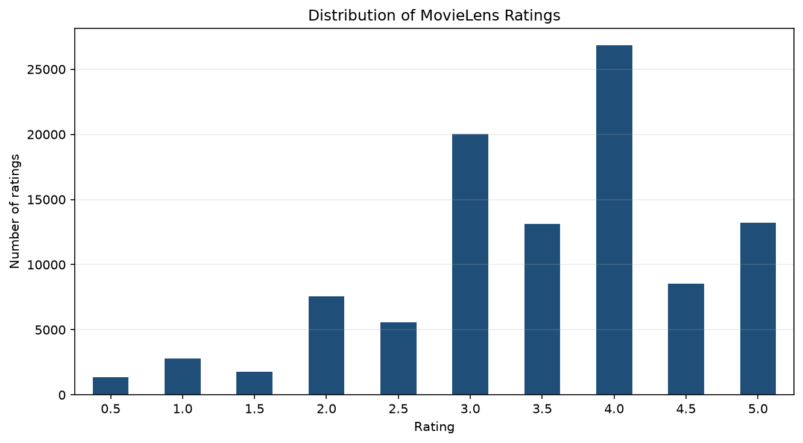
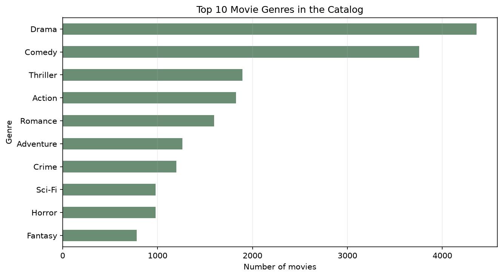
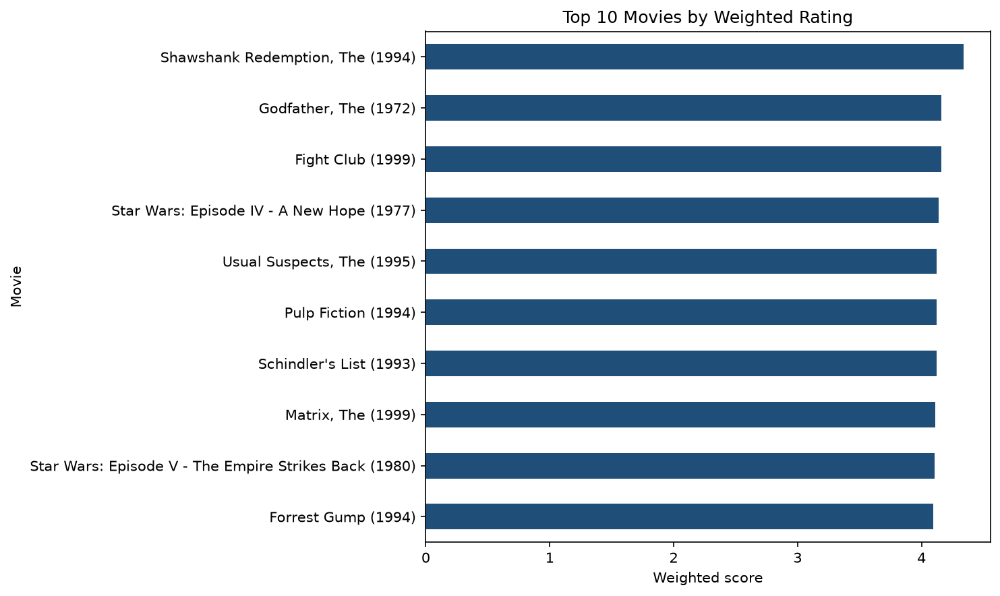

# DSA 4060 Week 1 Popularity Recommender

## Student

- Name: Nicholas Kinyanjui
- Student number: 670178

## Project overview

This project explores MovieLens user-item ratings and builds two non-personalized movie recommendation baselines: a minimum-rating popularity recommender and a weighted-rating recommender.

## Dataset

The project uses the MovieLens `latest-small` dataset from GroupLens:

- Source: https://grouplens.org/datasets/movielens/latest/
- Files used: `movies.csv` and `ratings.csv`
- Date accessed: 2026-09-21

The dataset zip is stored in `data/ml-latest-small.zip` for local reproducibility. The notebook extracts it into `data/ml-latest-small/` when needed.

## Methods

1. Rating-count and average-rating exploration
2. Minimum-rating popularity baseline
3. Weighted-rating baseline
4. Method comparison, visualization, and basic output checks

## How the code works

The notebook starts by setting up relative project paths for the `data/` and `images/` folders. It then loads `movies.csv` and `ratings.csv` from the MovieLens `latest-small` dataset. The first checks confirm the shape of the data, column names, missing values, and duplicate records so that the recommender is built on clean inputs.

After validation, the code explores the dataset by counting users, movies, ratings, and the sparsity of the user-item matrix. Sparsity is important because it shows that most users have rated only a small portion of the full movie catalog. The notebook also summarizes how ratings are distributed across users and movies.

The main recommender table is created by grouping ratings by `movieId`. For each movie, the code calculates `rating_count` and `average_rating`, then joins those results back to the movie titles and genres. The first recommender function, `recommend_popular_movies`, filters out movies below a minimum number of ratings and ranks the remaining movies by average rating, rating count, and title.

The weighted recommender uses a more conservative formula. It calculates the overall average rating, finds the 90th-percentile rating-count threshold, and gives each qualified movie a weighted score. Movies with many ratings keep more of their own average rating, while movies with fewer ratings are pulled closer to the overall average. This helps reduce the risk of over-ranking movies that have high averages from too few ratings.

Finally, the notebook compares the two Top 10 lists, saves the weighted Top 10 chart, tests the outputs with assertions, tries different rating thresholds, and demonstrates a simple genre filter.

## How to run

1. Clone the repository.
2. Install packages: `pip install -r requirements.txt`
3. Open `notebooks/week1_popularity_recommender.ipynb`.
4. Run all cells from top to bottom.

## Key findings

The dataset contains 610 users, 9,742 movies, and 100,836 ratings. Only about 1.7% of possible user-movie pairs have ratings, so the rating matrix is very sparse.

`Forrest Gump (1994)` received the most ratings with 329 ratings and an average rating of 4.16. Under the minimum-50-ratings method, `Shawshank Redemption, The (1994)` ranked first with 317 ratings and an average rating of 4.43. The weighted-rating method also ranked `Shawshank Redemption, The (1994)` first, with a weighted score of 4.34.

The two Top 10 lists overlap on three titles: `Fight Club (1999)`, `Godfather, The (1972)`, and `Shawshank Redemption, The (1994)`. The weighted method is more conservative because it uses the 90th-percentile rating-count threshold and pulls each score toward the overall average.

## Visual results

The rating distribution shows that whole-number and half-star ratings are both used, with many ratings clustered around 3.0 to 4.0.



The genre chart shows the most common genre labels in the movie catalog. Drama and Comedy appear most often, so a popularity-only recommender can easily overrepresent broad mainstream categories.



The final chart shows the Top 10 movies after applying the weighted-rating method.



## Limitations

The recommendations are not personalized because every user receives the same ranked list. The approach can reinforce popularity bias, gives limited exposure to new or niche movies, and cannot explain why users liked a movie. New movies with no ratings also face a cold-start problem.

## Repository structure

```text
.
├── data/
│   └── ml-latest-small.zip
├── images/
│   ├── rating_distribution.png
│   ├── top_genres.png
│   └── top10_recommendations.png
├── notebooks/
│   └── week1_popularity_recommender.ipynb
├── .gitignore
├── README.md
└── requirements.txt
```
